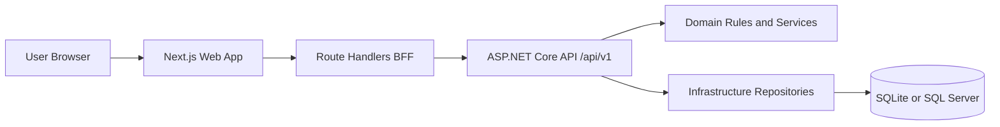

# Learning Bank

Learning Bank is a parent-supervised teaching application that helps children learn deposits, savings, transfers, and spending visibility through a safe online banking style experience.

## Repository Overview

- Backend API: src/LearningBank.Api
- Domain model and business rules: src/LearningBank.Domain
- Persistence and EF Core implementation: src/LearningBank.Infrastructure
- Frontend web app: src/learning-bank-web
- Tests: tests
- Component documentation: docs

## Detailed Documentation

- Documentation index: [docs/README.md](docs/README.md)
- Environment setup guide: [docs/environment-setup.md](docs/environment-setup.md)
- Domain documentation: [docs/domain.md](docs/domain.md)
- Infrastructure documentation: [docs/infrastructure.md](docs/infrastructure.md)
- API documentation: [docs/api.md](docs/api.md)
- Web documentation: [docs/web.md](docs/web.md)

## Architecture at a Glance



## Core Product Flows

### Child experience
- View checking and savings balances.
- View transaction history per account.
- Submit deposits with category selection.
- Transfer checking to savings when funds exist.
- Request savings to checking transfer for parent review.

### Parent experience
- View linked children.
- Add child accounts.
- Submit deposits and withdrawals for linked children.
- Review pending savings withdrawal requests.
- Manage category catalog with archive and child-allowed controls.

## Local Development Setup

## Prerequisites
- .NET SDK 10
- Node.js 22 LTS
- npm

## Environment setup
1. Copy src/learning-bank-web/.env.example to src/learning-bank-web/.env.local.
2. Fill all required OIDC and auth values.
3. Follow provider setup instructions in [docs/environment-setup.md](docs/environment-setup.md).

Required variables are documented in src/learning-bank-web/.env.example and explained in detail in [docs/environment-setup.md](docs/environment-setup.md).

Environment values required for local startup:
- AUTH_SECRET
- GOOGLE_CLIENT_ID
- GOOGLE_CLIENT_SECRET
- AZURE_AD_CLIENT_ID
- AZURE_AD_CLIENT_SECRET
- NEXT_PUBLIC_API_URL
- NEXTAUTH_URL

## Start both services (recommended)

```powershell
./dev.ps1
```

Service URLs:
- API: https://localhost:5001
- Web: http://localhost:3000

## Start services manually

API:
```powershell
cd src/LearningBank.Api
dotnet run
```

Web:
```powershell
cd src/learning-bank-web
npm install
npm run dev
```

## Build and Test

From repository root:

```powershell
dotnet build
dotnet test
```

From src/learning-bank-web:

```powershell
npm run typecheck
npm run test
npm run build
```

## Authentication Notes

The web app uses NextAuth with Google and Microsoft Entra ID providers.
The API validates bearer tokens and applies role policies for Parent and Child behavior.

## Data and Persistence

- Local default provider: SQLite
- Default database file: src/LearningBank.Api/App_Data/learningbank.dev.db
- Provider selection is controlled by Database:Provider in API configuration.

## Current State and Known Gaps

- Domain tests are implemented and passing.
- API test project exists, but integration test classes are not yet added.
- docker-compose.yml references Dockerfiles that are currently not present in the repository.

## Contribution Guidance

1. Keep business invariants in the domain layer first.
2. Keep API endpoints thin and policy-aware.
3. Keep web client data flows through BFF route handlers.
4. Add tests with each non-trivial change.

## Additional References

- Copilot project instructions: [.github/copilot-instructions.md](.github/copilot-instructions.md)
- Design system source: [DESIGN.md](DESIGN.md)
