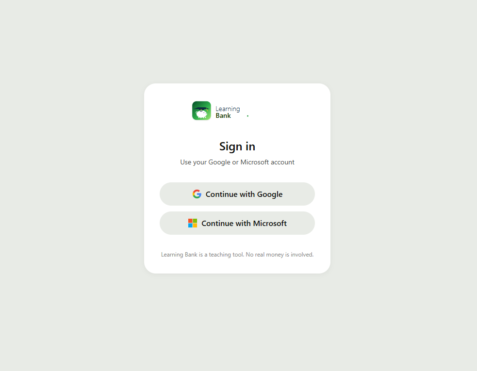
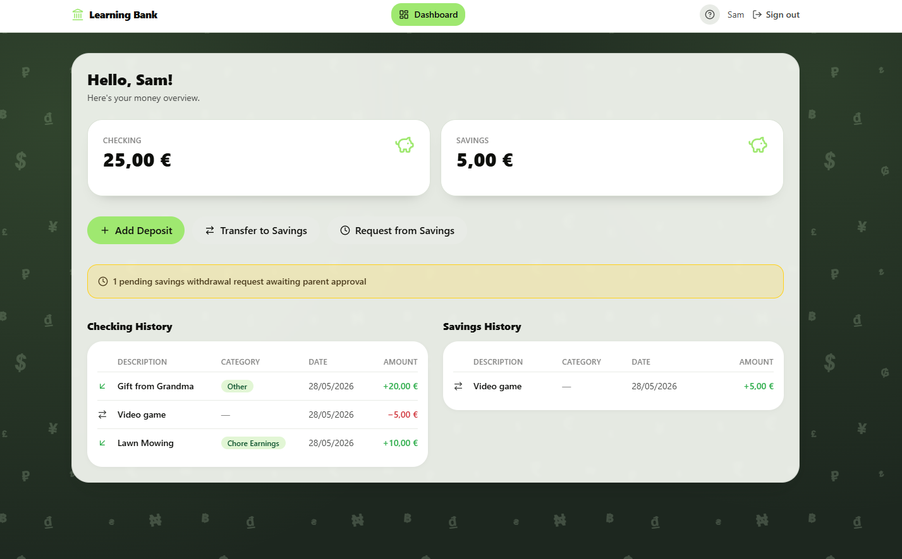
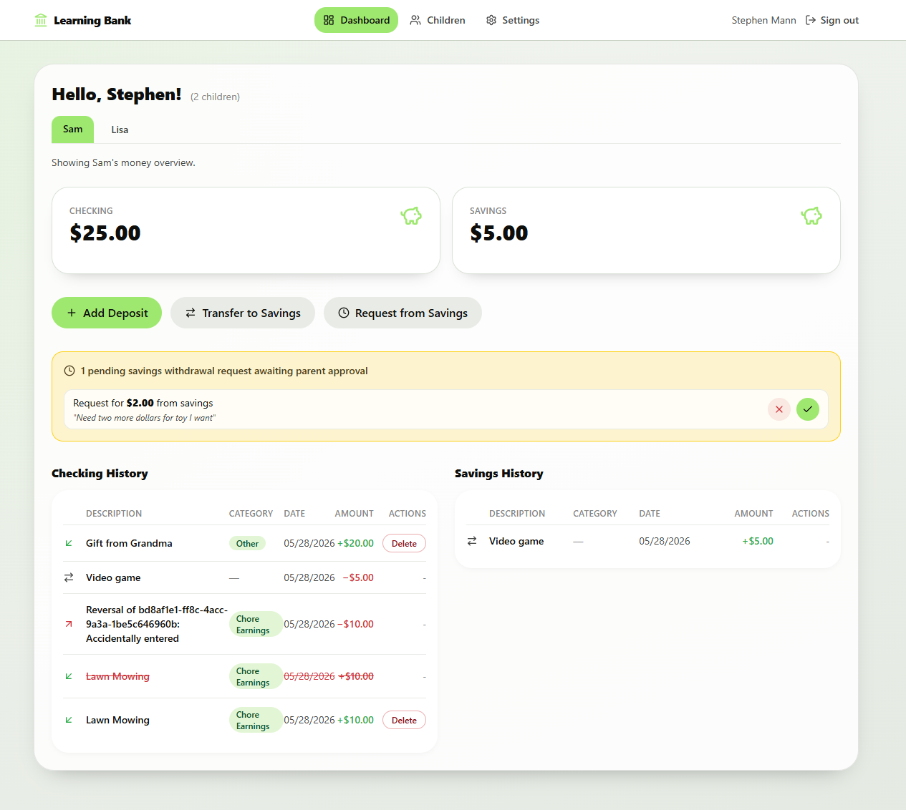
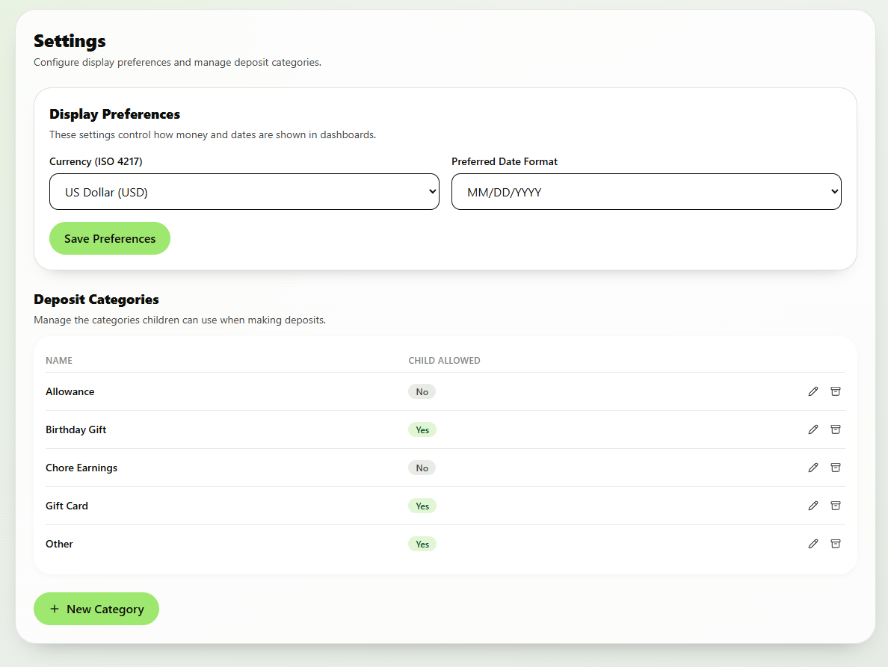
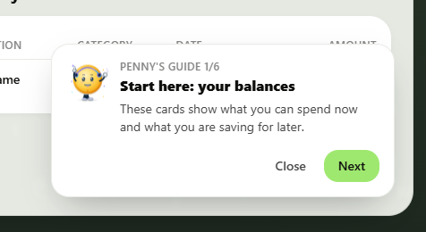

# My Learning Bank Documentation Index

This directory contains implementation-focused component documentation.

## Component Guides
- Environment setup index: [environment-setup.md](environment-setup.md)
- Auth setup: [auth-setup.md](auth-setup.md)
- Azure dev deploy: [azure-dev-deploy.md](azure-dev-deploy.md)
- Azure prod deploy: [azure-prod-deploy.md](azure-prod-deploy.md)
- API: [api.md](api.md)
- Domain: [domain.md](domain.md)
- Infrastructure: [infrastructure.md](infrastructure.md)
- Web: [web.md](web.md)

## Deployment Infrastructure
- Azure Bicep templates are in infra/azure.
- Deployment workflows apply infra/azure/main.bicep before application deployment.

## Suggested Reading Order
1. domain.md
2. infrastructure.md
3. api.md
4. web.md

## Visual Reference

These screenshots show the current product surfaces and the child-focused Penny guide.

### Sign-in page

### Child dashboard

### Parent dashboard

### Settings page

### Penny guide

## Why this order
- Domain defines core rules and contracts.
- Infrastructure implements domain persistence contracts.
- API orchestrates auth, validation, and use cases.
- Web consumes API behavior and renders user experiences.
