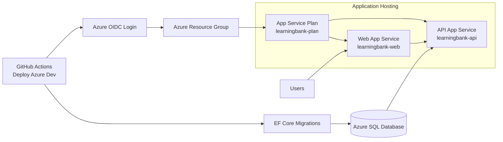

# Azure Dev Deploy Guide

This guide documents deployment requirements for .github/workflows/deploy-azure-dev.yaml.

The dev workflow deploys directly to production slots disabled mode:
- createStagingSlots=false
- No slot swap

## Infrastructure Diagram

## What The Workflow Does
1. Signs in to Azure using OIDC.
2. Deploys infra/azure/main.bicep.
3. Publishes API and web artifacts.
4. Runs EF Core migrations.
5. Deploys API and web directly to app production endpoints.
6. Runs API and web smoke tests.

## Required Azure Prerequisites
1. Resource group exists.
2. OIDC deployment identity has Contributor access at resource group scope.
3. Database exists and is reachable from GitHub-hosted runners.
4. App names match workflow defaults unless you customize workflow env values.

## Required GitHub Variables
- AZURE_CLIENT_ID
- AZURE_TENANT_ID
- AZURE_SUBSCRIPTION_ID
- AZURE_RESOURCE_GROUP (optional)
- API_AUTH_AUTHORITY
- API_AUTH_AUDIENCE
- GOOGLE_CLIENT_ID
- AZURE_AD_CLIENT_ID
- AZURE_AD_TENANT_ID
- NEXTAUTH_URL
- NEXT_PUBLIC_API_URL

## Required GitHub Secrets
- API_CONNECTION_STRING
- AUTH_SECRET
- GOOGLE_CLIENT_SECRET
- AZURE_AD_CLIENT_SECRET

## Bicep Inputs Passed By Dev Workflow
- appServicePlanName=learningbank-plan
- apiAppName=learningbank-api
- webAppName=learningbank-web
- createStagingSlots=false
- apiAuthAuthority and apiAuthAudience from repository variables
- nextAuthUrl and nextPublicApiUrl from repository variables
- OAuth and DB secrets from repository secrets

## OIDC Setup
1. Create an Entra app registration for GitHub deployment.
2. Add federated credential for this repository and main branch.
3. Assign Contributor role on the resource group.
4. Save client ID, tenant ID, and subscription ID in repository variables.

## Deployment Validation
1. Manually dispatch Deploy Azure Dev from main.
2. Confirm Azure Login succeeds.
3. Confirm Deploy Azure infrastructure succeeds.
4. Confirm EF migration succeeds.
5. Confirm smoke tests pass:
- API health endpoint
- Web root endpoint

## Common Failures

### Azure login failure
- Verify OIDC federated credential branch and repository match exactly.
- Verify AZURE_CLIENT_ID, AZURE_TENANT_ID, AZURE_SUBSCRIPTION_ID values.

### Resource not found
- Verify AZURE_RESOURCE_GROUP and app names are correct.

### EF migration failure
- Verify API_CONNECTION_STRING and database firewall/routing.
- Verify migration identity has required DB permissions.

### Smoke test failure
- Check startup logs in App Service.
- Verify required app settings were applied by Bicep.
