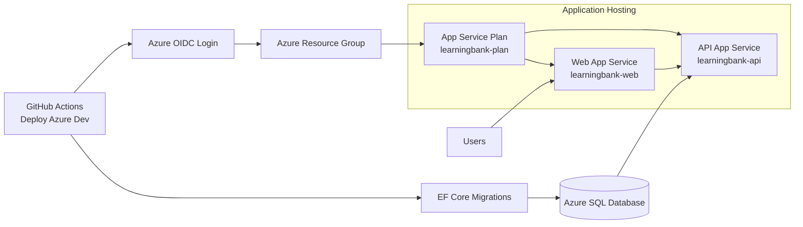

# Azure Dev Deploy Guide

This guide documents deployment requirements for .github/workflows/deploy-azure-dev.yaml.

The dev workflow deploys directly to production slots disabled mode:
- createStagingSlots=false
- No slot swap

## Infrastructure Diagram

## What The Workflow Does
1. Signs in to Azure using OIDC.
2. Deploys infra/azure/main.bicep.
3. Publishes API and web artifacts.
4. Runs EF Core migrations.
5. Deploys API and web directly to app production endpoints.
6. Runs API and web smoke tests.

## Required Azure Prerequisites
1. Resource group exists.
2. OIDC deployment identity has both **Contributor** and **User Access
   Administrator** at resource group scope. Contributor provisions the
   resources; User Access Administrator is required because the template
   creates role assignments (the Key Vault Secrets User grants to the app
   identities). Owner also works in place of both. No Microsoft Graph /
   directory-read permission is needed — the deploy identity's object id is read
   from its own OIDC token claim.
3. App names match workflow defaults unless you customize workflow env values.
4. The required resource providers are registered. The workflow registers them
   automatically (Microsoft.Sql, Microsoft.Web, Microsoft.KeyVault,
   Microsoft.ManagedIdentity, Microsoft.OperationalInsights, Microsoft.Insights),
   which requires the deploy identity to have the `*/register/action` permission
   at subscription scope. If it is only scoped to the resource group, register
   the providers once manually with `az provider register --namespace <ns>`.

## Required GitHub Variables
- AZURE_CLIENT_ID
- AZURE_TENANT_ID
- AZURE_SUBSCRIPTION_ID
- AZURE_RESOURCE_GROUP (optional)
- API_AUTH_AUTHORITY
- API_AUTH_AUDIENCE
- GOOGLE_CLIENT_ID
- AZURE_AD_CLIENT_ID
- AZURE_AD_TENANT_ID
- NEXTAUTH_URL
- NEXT_PUBLIC_API_URL

## Required GitHub Secrets
- AUTH_SECRET
- GOOGLE_CLIENT_SECRET
- AZURE_AD_CLIENT_SECRET

## Database Authentication (Managed Identity)
The Azure SQL server and serverless database are **provisioned by the Bicep
deployment** (server `learningbank-sql-dev`, database `learningbank`); their
FQDN and name are deployment outputs, not stored variables. The API connects
passwordlessly via its system-assigned managed identity
(`Authentication=Active Directory Default`).

A user-assigned managed identity (`learningbank-sql-admin`) is the server's
Entra-only admin. A Bicep deployment script runs as that identity and creates
the contained database users automatically:
- the API app managed identity — `db_datareader` + `db_datawriter`;
- the GitHub deploy service principal — also `db_ddladmin`, for EF migrations.

EF Core migrations read the SQL FQDN/database name from the deployment outputs
and connect as the deploy identity. No SQL credentials are stored anywhere.

## Bicep Inputs Passed By Dev Workflow
- appServicePlanName=learningbank-plan
- apiAppName=learningbank-api
- webAppName=learningbank-web
- createStagingSlots=false
- apiAuthAuthority and apiAuthAudience from repository variables
- nextAuthUrl and nextPublicApiUrl from repository variables
- OAuth and DB secrets from repository secrets

## OIDC Setup
1. Create an Entra app registration for GitHub deployment.
2. Add federated credential for this repository and main branch.
3. Assign Contributor role on the resource group.
4. Save client ID, tenant ID, and subscription ID in repository variables.

## Deployment Validation
1. Manually dispatch Deploy Azure Dev from main.
2. Confirm Azure Login succeeds.
3. Confirm Deploy Azure infrastructure succeeds.
4. Confirm EF migration succeeds.
5. Confirm smoke tests pass:
- API health endpoint
- Web root endpoint

## Common Failures

### Azure login failure
- Verify OIDC federated credential branch and repository match exactly.
- Verify AZURE_CLIENT_ID, AZURE_TENANT_ID, AZURE_SUBSCRIPTION_ID values.

### Resource not found
- Verify AZURE_RESOURCE_GROUP and app names are correct.

### EF migration failure
- Verify the Bicep deployment provisioned the SQL server and the deployment-script step (configure-sql-users) succeeded.
- Verify the OIDC deploy identity received its db_ddladmin user and the SQL firewall allows Azure services.

### Smoke test failure
- Check startup logs in App Service.
- Verify required app settings were applied by Bicep.
