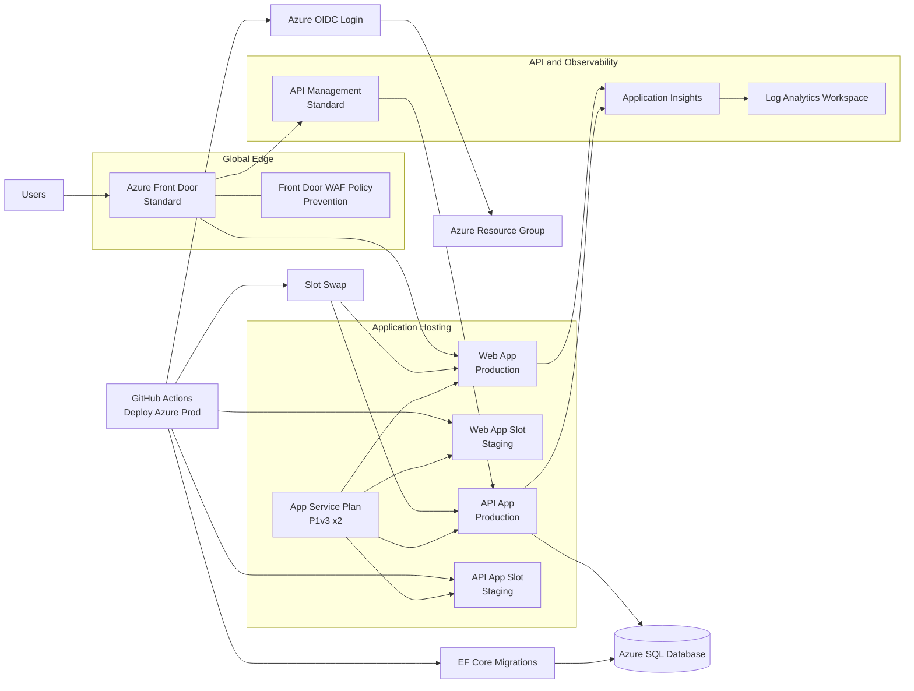

# Azure Prod Deploy Guide

This guide documents deployment requirements for .github/workflows/deploy-azure-prod.yaml.

The prod workflow is slot-based and deploys production architecture components:
- Staging slots with swap for API and web
- Azure Front Door in front of web and API routes
- API Management in front of API app
- Log Analytics and Application Insights
- Front Door WAF policy in prevention mode

## Infrastructure Diagram

## What The Workflow Does
1. Signs in to Azure using OIDC.
2. Deploys infra/azure/main.bicep with production parameters.
3. Publishes API and web artifacts.
4. Deploys to staging slots.
5. Runs EF Core migrations.
6. Smoke tests staging endpoints.
7. Swaps staging to production.
8. Smoke tests Front Door endpoint.

## Production Infrastructure Parameters
The workflow passes these production-focused values:
- appServicePlanSkuName=P1v3
- appServicePlanSkuTier=PremiumV3
- appServicePlanCapacity=2
- enableObservability=true
- enableApiManagement=true
- apiManagementSkuName=Standard
- apiManagementSkuCapacity=1
- enableFrontDoor=true
- frontDoorSkuName=Standard_AzureFrontDoor
- logRetentionInDays=30

## Required GitHub Variables
- AZURE_CLIENT_ID
- AZURE_TENANT_ID
- AZURE_SUBSCRIPTION_ID
- AZURE_RESOURCE_GROUP (optional)
- API_AUTH_AUTHORITY
- API_AUTH_AUDIENCE
- GOOGLE_CLIENT_ID
- AZURE_AD_CLIENT_ID
- AZURE_AD_TENANT_ID
- NEXTAUTH_URL
- NEXT_PUBLIC_API_URL
- API_MANAGEMENT_PUBLISHER_EMAIL (optional, default fallback exists)
- API_MANAGEMENT_PUBLISHER_NAME (optional, default fallback exists)

## Required GitHub Secrets
- AUTH_SECRET
- GOOGLE_CLIENT_SECRET
- AZURE_AD_CLIENT_SECRET

## Database Authentication (Managed Identity)
The Azure SQL server and serverless database are **provisioned by the Bicep
deployment** (server `learningbank-sql-prod`, database `learningbank`); their
FQDN and name are deployment outputs, not stored variables. The API connects
passwordlessly via its system-assigned managed identity
(`Authentication=Active Directory Default`); no SQL credentials are stored or
placed in Key Vault.

A user-assigned managed identity (`learningbank-sql-admin`) is the server's
Entra-only admin. A Bicep deployment script runs as that identity and creates
the contained database users automatically:
- the API app managed identity — `db_datareader` + `db_datawriter`;
- the API staging-slot managed identity — `db_datareader` + `db_datawriter`;
- the GitHub deploy service principal — also `db_ddladmin`, for EF migrations.

EF Core migrations read the SQL FQDN/database name from the deployment outputs
and connect as the deploy identity.

## Required Azure Prerequisites
1. Resource group exists.
2. OIDC deployment identity has both **Contributor** and **User Access
   Administrator** at resource group scope. Contributor provisions the
   resources; User Access Administrator is required because the template
   creates role assignments (the Key Vault Secrets User grants to the app
   identities). Owner also works in place of both. No Microsoft Graph /
   directory-read permission is needed — the deploy identity's object id is read
   from its own OIDC token claim.
3. App Service, APIM, and Front Door naming do not conflict in target subscription.

## Deployment Validation
1. Manually dispatch Deploy Azure Prod from main.
2. Confirm Azure Login succeeds.
3. Confirm Bicep deployment succeeds.
4. Confirm API and web staging smoke tests pass.
5. Confirm slot swaps succeed.
6. Confirm Front Door smoke test passes.

## Post-Deploy Checks
- API app responds on production.
- Web app responds on production.
- Front Door endpoint responds.
- APIM gateway is provisioned and routing API paths.
- Application Insights receives telemetry.

## Common Failures

### Front Door hostname lookup fails
- Verify profile and endpoint names from workflow env values.
- Verify Front Door resources were created successfully by Bicep deployment.

### APIM provisioning takes longer than expected
- Re-run if timeout occurred while APIM finished provisioning.
- Check APIM activity log for long-running operations.

### Slot swap issues
- Validate both staging slots are healthy before swap.
- Check app startup errors and required configuration values.

### Smoke test failures
- Validate DNS and endpoint names from deployment outputs.
- Review App Service and Front Door diagnostics.
